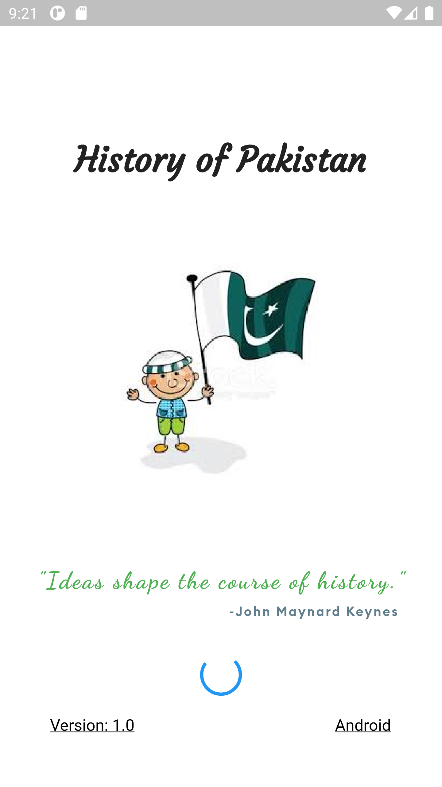

# History App (Released v1.0.0 on 21st March 2021)

## Minimal Viable Product (MVP):

Picture based quiz for
- History (Indus Valley Civilization, Mughal Rule)
- Culture/Provinces
- Geography (Continents & Pakistan Map)
- Human Rights and Constitutional Rights

Drag & Drop
- Map point 
- Heroes
- Cultural Dresses/ Music

## Future Suggestions
- YouTube video
- National Anthem/Song
- Videos on Cultural Diversity

# Authors

##### - Naeema Siddiqui
##### - Farwa Zehra
##### - Mubahil Faaiz
##### - Syed Muzammil Ali

